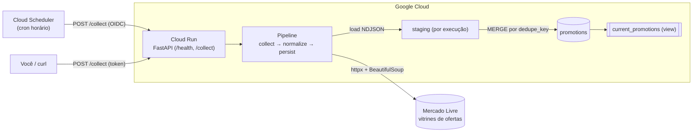
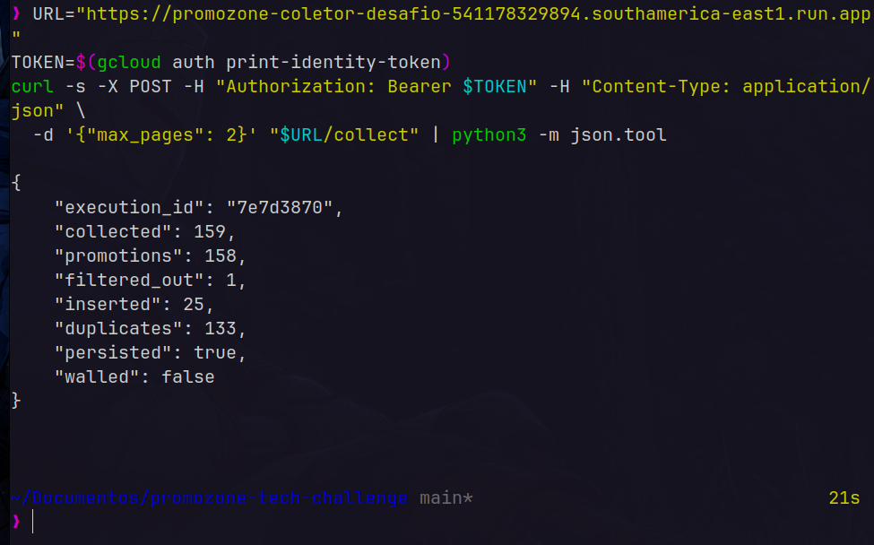
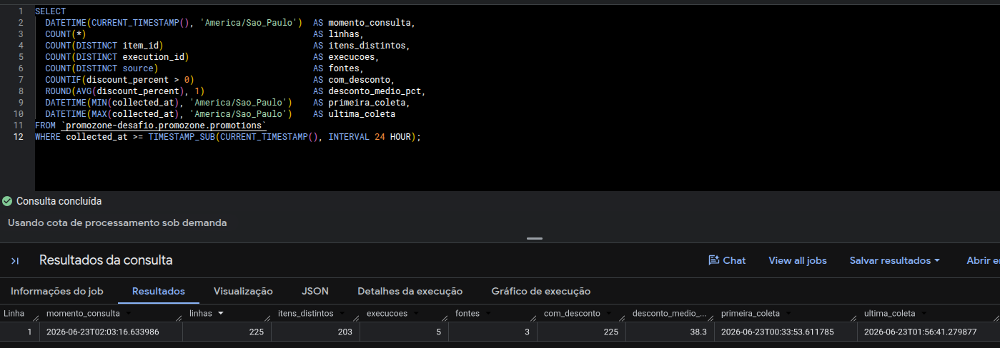
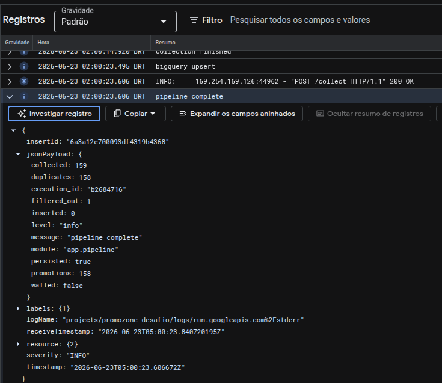
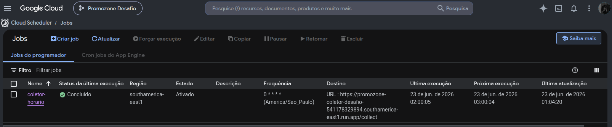
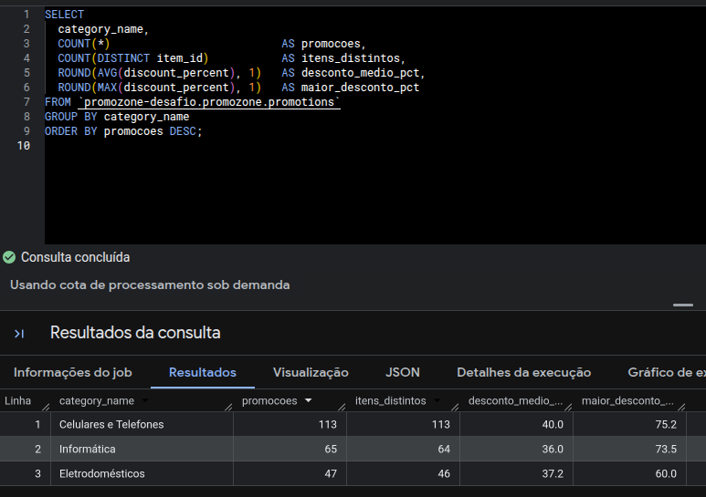
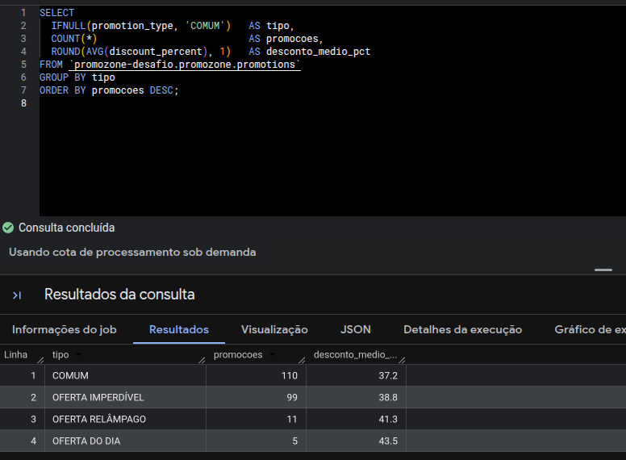
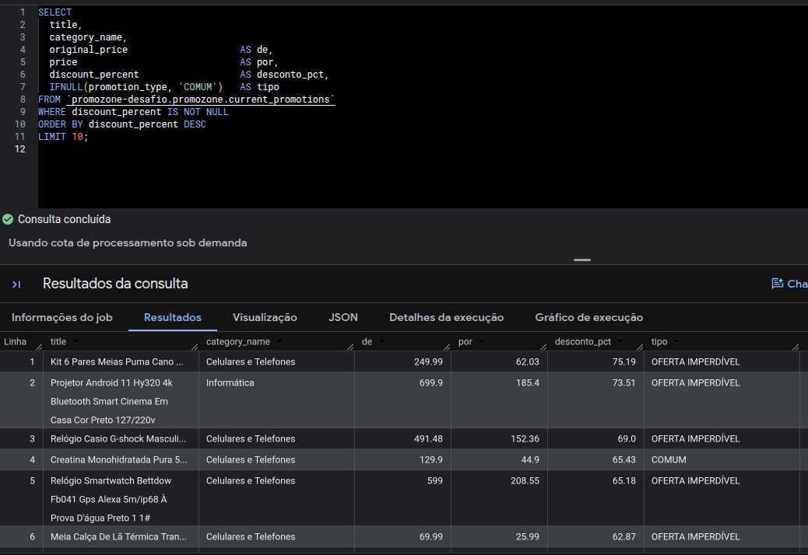
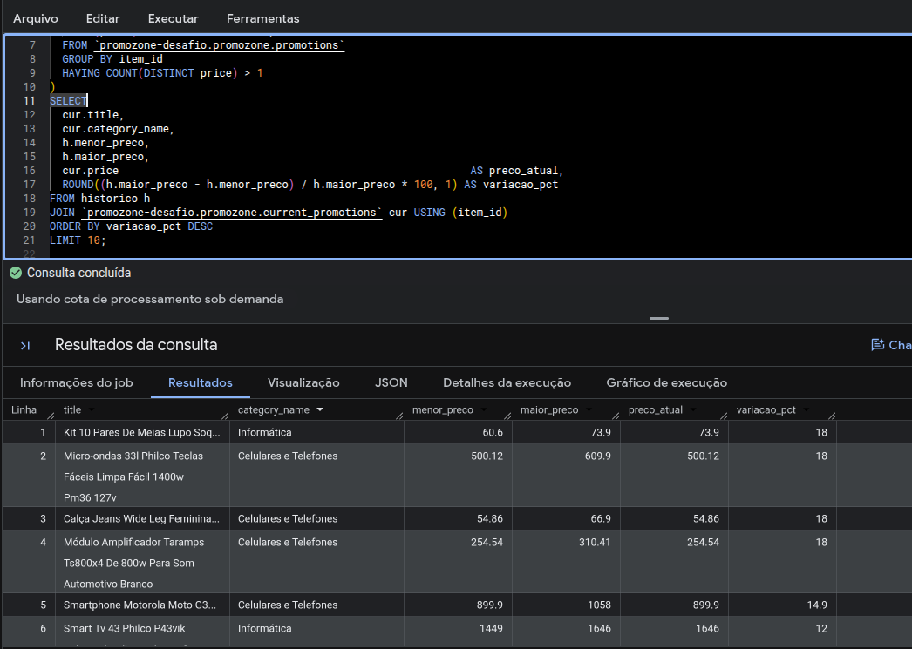
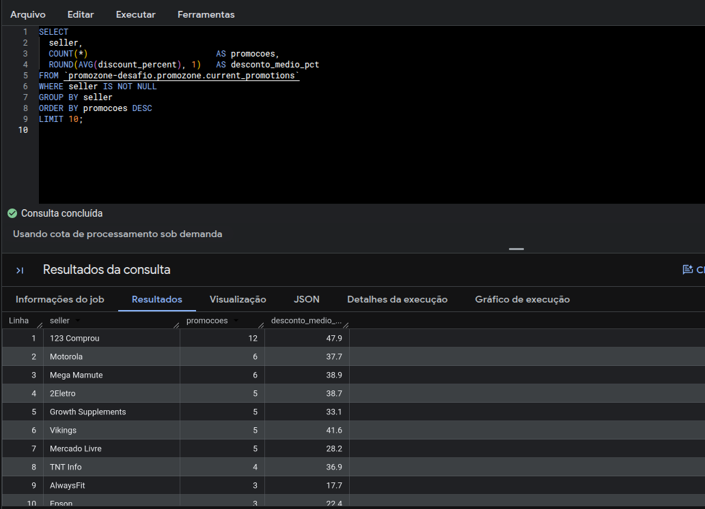

# Coletor de Promoções — Mercado Livre → BigQuery

Protótipo **fim-a-fim** que coleta promoções do Mercado Livre, normaliza, **deduplica** e grava no **BigQuery**, com logs estruturados e um endpoint de saúde — rodando no **Google Cloud Run** e agendado pelo **Cloud Scheduler**.

`Python 3.12` · `httpx + BeautifulSoup` · `Pydantic` · `FastAPI` · `BigQuery` · `Cloud Run` · `44 testes`

---

## Rodar em 2 minutos (sem GCP)

O jeito mais rápido de ver o pipeline funcionando — **sem credencial, sem GCP, sem deploy**. O modo `--dry-run` coleta de verdade do Mercado Livre, normaliza e **imprime o JSON**, sem tocar no BigQuery.

```bash
git clone https://github.com/WagnerVic/promozone-tech-challenge.git && cd promozone-tech-challenge

python3 -m venv .venv && source .venv/bin/activate   # Windows: .venv\Scripts\activate
pip install -r requirements.txt

python -m app.cli --dry-run --max-pages 1
```

Você verá um resumo + uma amostra dos itens normalizados:

```json
{
  "summary": {
    "execution_id": "a1b2c3d4",
    "collected": 124,
    "promotions": 119,
    "filtered_out": 5,
    "inserted": null,
    "duplicates": null,
    "persisted": false,
    "walled": false
  },
  "sample": [
    {
      "item_id": "MLB47115842",
      "title": "Smartphone Samsung Galaxy A36 5G 128GB ...",
      "price": "1318.00",
      "original_price": "2538.00",
      "discount_percent": 48.07,
      "category": "MLB1051",
      "category_name": "Celulares e Telefones",
      "promotion_type": "OFERTA IMPERDÍVEL",
      "dedupe_key": "mercado_livre_MLB47115842_1318.00"
    }
  ]
}
```

- `persisted: false` → no `--dry-run` nada é gravado.
- `walled: false` → não batemos no muro anti-bot do ML (ver [Investigação anti-bot](#investigação-anti-bot)).

Pronto: o pipeline `coleta → normaliza → filtra promoção real` funcionou na sua máquina. Pra gravar no BigQuery ou subir a API, siga as seções abaixo.

---

## Sumário

- [Rodar em 2 minutos (sem GCP)](#rodar-em-2-minutos-sem-gcp)
- [Arquitetura](#arquitetura)
- [Stack](#stack)
- [Rodar localmente (completo)](#rodar-localmente-completo)
- [Deploy no GCP](#deploy-no-gcp)
- [Credenciais e permissões](#credenciais-e-permissões)
- [Fontes coletadas](#fontes-coletadas)
- [Investigação anti-bot](#investigação-anti-bot)
- [Schema do BigQuery](#schema-do-bigquery)
- [Deduplicação](#deduplicação)
- [Query de validação](#query-de-validação)
- [Observabilidade](#observabilidade)
- [Agendamento](#agendamento)
- [Relatório de métricas (extra)](#relatório-de-métricas-extra)
- [Testes](#testes)
- [Trade-offs](#trade-offs)
- [Firecrawl](#firecrawl)
- [Limitações e transparência](#limitações-e-transparência)
- [Limpeza de recursos](#limpeza-de-recursos)

---

## Arquitetura



**Pipeline por execução:** busca as vitrines de ofertas (httpx, com retry/backoff e delay entre páginas) → parseia os cards → normaliza com Pydantic (filtrando **só promoção real**) → carrega o lote NDJSON numa **staging por execução** → roda um **`MERGE`** staging → `promotions` (insere o novo, atualiza `last_seen_at` no que já existe) → devolve um resumo com as contagens. Tudo síncrono dentro do `POST /collect`.

---

## Stack

| Camada | Tecnologia | Por quê |
|---|---|---|
| Coleta | `httpx` + `BeautifulSoup` + `lxml` | As vitrines de ofertas são server-rendered → não precisa de navegador headless |
| Normalização | `Pydantic` + `pydantic-settings` | Validação automática e config 12-factor (env vars) |
| Resiliência | `tenacity` | Retry com backoff só em falhas transitórias (rede, 5xx, 429) |
| API | `FastAPI` + `uvicorn` | `/health` e `/collect`, com Swagger em `/docs` |
| Persistência | `google-cloud-bigquery` | Tabela `promotions` + staging + MERGE |
| Logs | `python-json-logger` | JSON estruturado, nativo do Cloud Logging |
| Execução | Cloud Run + Cloud Scheduler + Docker | Serviço HTTP que escala a zero, agendado por cron |

---

## Rodar localmente (completo)

Pré-requisito: Python 3.12+.

```bash
python3 -m venv .venv && source .venv/bin/activate
pip install -r requirements.txt
cp .env.template .env          # ajuste as variáveis (ver "Credenciais e permissões")
```

**1) CLI sem GCP (`--dry-run`)** — coleta, normaliza e imprime JSON:

```bash
python -m app.cli --dry-run                 # usa as 3 categorias padrão
python -m app.cli --dry-run --max-pages 2 --source "https://www.mercadolivre.com.br/ofertas?category=MLB1051"
```

**2) CLI gravando no BigQuery** — exige credencial (ADC) e `GOOGLE_CLOUD_PROJECT` no `.env`:

```bash
gcloud auth application-default login        # gera o ADC local
python -m app.cli                            # coleta e persiste (MERGE)
```

**3) API (FastAPI)** — local com `uvicorn`:

```bash
uvicorn app.api:app --reload
curl localhost:8000/health
curl -X POST localhost:8000/collect -H "Content-Type: application/json" -d '{"max_pages": 2}'
```

**4) Docker (compose)** — sobe o container com o ADC montado:

```bash
docker compose up --build
curl localhost:8000/health
```

---

## Deploy no GCP

Passo a passo reproduzível (valores deste projeto: `promozone-desafio`, região `southamerica-east1`). Troque pelo seu projeto.

```bash
# 0) Projeto e APIs
gcloud config set project promozone-desafio
gcloud services enable bigquery.googleapis.com run.googleapis.com \
  artifactregistry.googleapis.com cloudbuild.googleapis.com cloudscheduler.googleapis.com

# 1) Dataset BigQuery (mesma location que o .env)
bq --location=southamerica-east1 mk --dataset promozone-desafio:promozone

# 2) Artifact Registry (repositório de imagens)
gcloud artifacts repositories create docker-repo \
  --repository-format=docker --location=southamerica-east1

# 3) Service account de runtime + permissões mínimas no BigQuery
gcloud iam service-accounts create coletor-sa --display-name="Coletor de Promoções (Cloud Run)"
gcloud projects add-iam-policy-binding promozone-desafio \
  --member="serviceAccount:coletor-sa@promozone-desafio.iam.gserviceaccount.com" \
  --role="roles/bigquery.dataEditor"
gcloud projects add-iam-policy-binding promozone-desafio \
  --member="serviceAccount:coletor-sa@promozone-desafio.iam.gserviceaccount.com" \
  --role="roles/bigquery.jobUser"

# 4) Build da imagem (Cloud Build → Artifact Registry)
gcloud builds submit \
  --tag southamerica-east1-docker.pkg.dev/promozone-desafio/docker-repo/promozone-coletor:v1

# 5) Deploy no Cloud Run (autenticado, escala a zero)
gcloud run deploy promozone-coletor-desafio \
  --image=southamerica-east1-docker.pkg.dev/promozone-desafio/docker-repo/promozone-coletor:v1 \
  --region=southamerica-east1 \
  --service-account=coletor-sa@promozone-desafio.iam.gserviceaccount.com \
  --no-allow-unauthenticated \
  --set-env-vars=GOOGLE_CLOUD_PROJECT=promozone-desafio,GCP_DATASET_ID=promozone,BQ_TABLE=promotions,BQ_LOCATION=southamerica-east1 \
  --min-instances=0 --max-instances=1 --timeout=600
```

A tabela e a view são criadas **pelo próprio app** na primeira coleta (`ensure_table`/`ensure_view`) — os arquivos em [`sql/`](sql/) documentam o schema.

**Chamar o serviço (autenticado):** como o serviço exige autenticação, use um token de identidade:

```bash
URL="https://promozone-coletor-desafio-541178329894.southamerica-east1.run.app"
TOKEN=$(gcloud auth print-identity-token)
curl -H "Authorization: Bearer $TOKEN" "$URL/health"
curl -X POST -H "Authorization: Bearer $TOKEN" -H "Content-Type: application/json" \
  -d '{"max_pages": 2}' "$URL/collect"
```



---

## Credenciais e permissões

Nunca versionamos segredos — o `.env` e qualquer chave ficam no `.gitignore`. A autenticação muda conforme o ambiente:

| Ambiente | Como autentica | Detalhe |
|---|---|---|
| **Local (CLI/uvicorn)** | ADC do usuário (`gcloud auth application-default login`) | Sem arquivo de chave |
| **Docker local** | ADC montado read-only no container | Ver `docker-compose.yml` |
| **Cloud Run** | **Service account anexada** (`coletor-sa`) | **Sem key dentro da imagem** — a credencial vem automática |

**Princípio do menor privilégio** — duas service accounts, cada uma só com o que precisa:

- `coletor-sa` (runtime do serviço): `roles/bigquery.dataEditor` + `roles/bigquery.jobUser`.
- `coletor-scheduler` (quem chama o serviço): apenas `roles/run.invoker` (ver [Agendamento](#agendamento)).

O `/collect` sobe com `--no-allow-unauthenticated`: ninguém na internet aberta dispara a coleta — só quem tem token válido (você ou o Scheduler, via OIDC).

---

## Fontes coletadas

O enunciado pede de 1 a 3 fontes. Usamos **3 recortes de categoria** da vitrine de ofertas:

| `source` | Categoria |
|---|---|
| `/ofertas?category=MLB1051` | Celulares e Telefones |
| `/ofertas?category=MLB1648` | Informática |
| `/ofertas?category=MLB5726` | Eletrodomésticos |

Cada item carrega o `source` (URL que o gerou) e o `category`/`category_name` derivados dele.

> **Caveat de proveniência (honesto):** `category` é a **categoria do feed de ofertas que originou o item** — não uma taxonomia verificada do produto. O Mercado Livre às vezes mistura itens cross-category no feed de uma categoria (cross-sell/patrocinado), então um item de outra categoria pode aparecer marcado com a categoria do feed. É **proveniência** (de onde veio), não classificação do produto.

---

## Investigação anti-bot

A coleta por **busca/query**, **listagem por categoria** e **página de produto (PDP)** cai num muro de "tráfego suspeito → faça login" (`suspicious-traffic-frontend`), disparado por **reputação de IP de datacenter** — não é captcha nem JS; exige login real. A API oficial `/sites/MLB/search` responde **403**. Só as **vitrines curadas de ofertas** passam limpas.

| Rota | Resultado |
|---|---|
| Busca `lista.mercadolivre.com.br/{query}` | ❌ muro |
| Listagem por categoria / PDP | ❌ muro |
| API oficial `/sites/MLB/search` | ❌ 403 |
| **`/ofertas` e `/ofertas?category=...`** | ✅ 200, server-rendered |

Por isso coletamos das **vitrines de ofertas** e, como a categoria **não existe no card** (0/48 cards têm categoria), coletamos **por categoria** — o item herda a categoria da fonte. Furar o muro exigiria login/scraping autenticado, o que o enunciado proíbe ("nada de bypass de segurança").

O coletor **detecta o muro** (`walled`) e propaga o sinal até a resposta da API — uma coleta bloqueada não passa por sucesso silencioso (200 + 0 itens). Em produção, confirmamos **`walled: false`** a partir do IP do Google (Cloud Run) — ver o print da resposta do `/collect` na seção [Deploy no GCP](#deploy-no-gcp).

---

## Schema do BigQuery

Tabela `promotions` — criada pelo app, documentada em [`sql/promotions.sql`](sql/promotions.sql):

```sql
CREATE TABLE IF NOT EXISTS `promozone-desafio.promozone.promotions` (
  marketplace      STRING    NOT NULL,
  item_id          STRING    NOT NULL,   -- catálogo 'MLB123' ou anúncio 'MLB-123'
  url              STRING    NOT NULL,
  title            STRING    NOT NULL,
  price            NUMERIC   NOT NULL,   -- dinheiro exato (sem float)
  original_price   NUMERIC,
  discount_percent FLOAT64,
  seller           STRING,
  image_url        STRING,
  source           STRING    NOT NULL,   -- vitrine que gerou o item
  currency         STRING    NOT NULL,
  category         STRING    NOT NULL,   -- id da categoria de ofertas (MLB....)
  category_name    STRING    NOT NULL,   -- nome legível da categoria
  promotion_type   STRING,               -- badge do card (relâmpago/do dia/...); nullable
  dedupe_key       STRING    NOT NULL,   -- marketplace + item_id + price
  execution_id     STRING    NOT NULL,
  collected_at     TIMESTAMP NOT NULL,
  inserted_at      TIMESTAMP NOT NULL,   -- 1ª vez vista (server-side no MERGE)
  last_seen_at     TIMESTAMP NOT NULL    -- última vez vista (atualizada no MERGE)
)
PARTITION BY DATE(collected_at)          -- consultas por data varrem menos
CLUSTER BY dedupe_key;                   -- acelera o JOIN do MERGE/dedupe
```

Notas de modelagem:
- **`price`/`original_price` como `NUMERIC`** (não `FLOAT64`): dinheiro como decimal exato, sem drift de ponto flutuante. No código é `Decimal`, serializado como string → `NUMERIC`.
- **`item_id`**: catálogo (`/p/MLB123`) e anúncio (`MLB-123`) são namespaces distintos — não fundimos (id inconsistente quebraria o dedupe).
- **`PARTITION` + `CLUSTER`**: o equivalente a índice no BigQuery (não há `CREATE INDEX`).

A view `current_promotions` ([`sql/current_promotions.sql`](sql/current_promotions.sql)) devolve a **última linha por `item_id`** (estado atual), separando o preço vivo do histórico.

---

## Deduplicação

A `dedupe_key = marketplace + "_" + item_id + "_" + price` inclui o **preço** de propósito: o mesmo item com preço novo gera **linha nova** → a tabela vira um **histórico de preços** (base pra detectar promoção real). Mesmo item + mesmo preço = não duplica.

Estratégia idempotente (**staging + `MERGE`**):

1. O coletor deduplica **dentro da execução** (chaves únicas por `dedupe_key`).
2. O lote é carregado via **load job** numa staging por execução (`staging_<execution_id>`).
3. Um **`MERGE`** casa staging → `promotions` por `dedupe_key`:
   - `WHEN NOT MATCHED` → **INSERT** (promoção nova).
   - `WHEN MATCHED` → **UPDATE** `last_seen_at` (+ `promotion_type`; `category` congela).
4. A staging é dropada no `finally` (sem lixo, sem corrida entre execuções).

As contagens `inserted`/`duplicates` saem de um `COUNT` antes do MERGE (o MERGE só devolve o total). **Prova de idempotência:** rodar o mesmo lote 2× → a 2ª rodada insere **0** e reconhece todos como duplicados.

> Usamos **load job** (não streaming insert) porque o `MERGE` não funciona sobre o streaming buffer — trade-off consciente.

---

## Query de validação

Entregável pedido pelo enunciado ("uma query SQL de validação"). Arquivo: [`sql/validation_last24h.sql`](sql/validation_last24h.sql). Janela **rolante de 24h**, timestamps no **fuso de Brasília**, com um **check de integridade**:

```sql
SELECT
  DATETIME(CURRENT_TIMESTAMP(), 'America/Sao_Paulo')  AS momento_consulta,
  COUNT(*)                                            AS linhas,
  COUNT(DISTINCT item_id)                             AS itens_distintos,
  COUNT(DISTINCT execution_id)                        AS execucoes,
  COUNT(DISTINCT source)                              AS fontes,
  COUNTIF(discount_percent > 0)                       AS com_desconto,
  ROUND(AVG(discount_percent), 1)                     AS desconto_medio_pct,
  DATETIME(MIN(collected_at), 'America/Sao_Paulo')    AS primeira_coleta,
  DATETIME(MAX(collected_at), 'America/Sao_Paulo')    AS ultima_coleta
FROM `promozone-desafio.promozone.promotions`
WHERE collected_at >= TIMESTAMP_SUB(CURRENT_TIMESTAMP(), INTERVAL 24 HOUR);
```

O `COUNTIF(discount_percent > 0)` é um **check de integridade**: como só persistimos promoção real, `com_desconto` **deve** ser igual a `linhas`. Se vier menor, o filtro vazou.



---

## Observabilidade

- **Logs JSON estruturados** (stderr), nativos do Cloud Logging: cada entrada tem `severity` (elevado ao topo da entrada), `time` (timestamp do evento), `message`, `module` e `execution_id`.
- **Correlação por `execution_id`**: filtre `jsonPayload.execution_id="..."` e veja todos os logs de uma coleta.
- **Contagens** num único log (`pipeline complete`): `collected`, `promotions`, `filtered_out`, `inserted`, `duplicates`, `walled`.
- **Sinal de saúde**: `GET /health` (faz um ping leve no BigQuery; responde 200 mesmo degradado, indicando o estado).
- **Sinal de muro**: `walled` propagado collector → pipeline → `/collect`.



---

## Agendamento

A coleta roda sozinha via **Cloud Scheduler** ("cron na nuvem"), de hora em hora, chamando o `/collect` autenticado com **token OIDC**:

```bash
# SA dedicada de invoker (só pode CHAMAR o serviço)
gcloud iam service-accounts create coletor-scheduler --display-name="Invoker do Scheduler"
gcloud run services add-iam-policy-binding promozone-coletor-desafio \
  --region=southamerica-east1 \
  --member="serviceAccount:coletor-scheduler@promozone-desafio.iam.gserviceaccount.com" \
  --role="roles/run.invoker"

# Job horário (fuso BR), POST /collect com OIDC
gcloud scheduler jobs create http coletor-horario \
  --location=southamerica-east1 \
  --schedule="0 * * * *" --time-zone="America/Sao_Paulo" \
  --uri="https://promozone-coletor-desafio-541178329894.southamerica-east1.run.app/collect" \
  --http-method=POST --headers="Content-Type=application/json" --message-body='{"max_pages": 2}' \
  --oidc-service-account-email="coletor-scheduler@promozone-desafio.iam.gserviceaccount.com" \
  --oidc-token-audience="https://promozone-coletor-desafio-541178329894.southamerica-east1.run.app" \
  --attempt-deadline=120s
```

De hora em hora (`max_pages: 2`) são ~6 buscas no ML por rodada (~144/dia) — educado e suficiente pra construir histórico de preço.



---

## Relatório de métricas (extra)

Queries analíticas em [`sql/analysis.sql`](sql/analysis.sql) — extensão opcional do enunciado ("pequeno relatório com métricas").

**Por categoria** (volume + desconto médio):



**Por tipo de promoção** (relâmpago / do dia / imperdível / comum):



**Top descontos** (estado atual, via `current_promotions`):



**Mudança de preço** — itens vistos em mais de um preço (mín/máx/atual + variação), aproveitando que o `dedupe_key` inclui o preço:



**Top lojas** (vendedores com mais promoções):



---

## Testes

44 testes puros (sem rede, sem GCP), rodam em ~0,5s:

```bash
pip install -r requirements-dev.txt
pytest
ruff check app tests
```

Cobrem o que importa pra qualidade de dados: parsing de preço no locale BR (milhar + centavos), `item_id` catálogo vs anúncio, predicado de "promoção real", contrato modelo ↔ schema da staging, detecção de muro (`walled`) e propagação, resolução de categoria, e extração de `promotion_type`.

---

## Trade-offs

| Decisão | Escolha | Por quê |
|---|---|---|
| Gerenciador de pacotes | `pip` + venv (não uv) | Menor atrito pro avaliador rodar; reprodutibilidade |
| Gravação no BQ | Load job (não streaming) | `MERGE` não funciona sobre o streaming buffer |
| Dinheiro | `NUMERIC`/`Decimal` (não float) | Exatidão, sem drift binário |
| Concorrência | `/collect` síncrono + `max-instances=1` | Escopo pequeno; reforço contra coletas sobrepostas |
| `category` | Proveniência (feed), não taxonomia | O ML mistura feeds; documentado honestamente |
| Coleta | Por categoria (não vitrine misturada) | A categoria não vem do card; herda da fonte |
| CI/CD | Não incluído | Fora do escopo de um protótipo de 72h |

---

## Firecrawl

O enunciado sugere o Firecrawl como dica opcional. **Não usamos**: as vitrines de ofertas do Mercado Livre são **server-rendered**, então `httpx + BeautifulSoup + lxml` resolvem a extração com menos dependências e mais controle (seletores centralizados, testes de fixture). O Firecrawl agregaria uma dependência/serviço sem ganho neste caso.

---

## Limitações e transparência

- **Custo de escala do dedupe:** o `MERGE` e a contagem cruzam a staging com **todo o histórico** por `dedupe_key`, sem poda de partição → o custo cresce com a tabela. Em produção, limitaríamos a janela de dedupe (ex.: últimos N dias).
- **`category` = proveniência**, não taxonomia verificada (ver [Fontes coletadas](#fontes-coletadas)).
- **Histórico ainda jovem:** as métricas de mudança de preço ficam mais ricas conforme o Scheduler acumula execuções.
- **Egress dependente de reputação de IP:** o `/ofertas` passou do IP do Google (confirmado), mas isso é uma propriedade do provedor — o sinal `walled` existe justamente para detectar uma eventual mudança.

---

## Limpeza de recursos

Para parar a coleta automática e remover os recursos ao fim da avaliação (evitar qualquer custo):

```bash
gcloud scheduler jobs delete coletor-horario --location=southamerica-east1
gcloud run services delete promozone-coletor-desafio --region=southamerica-east1
bq rm -r -f -d promozone-desafio:promozone
```
</content>
